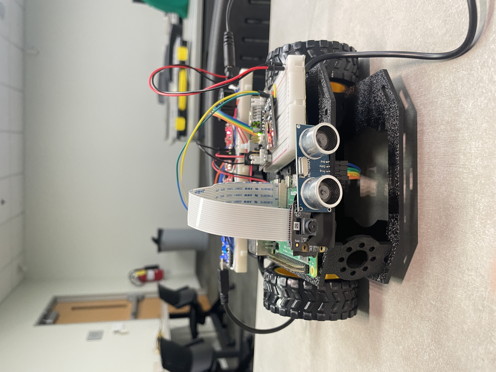
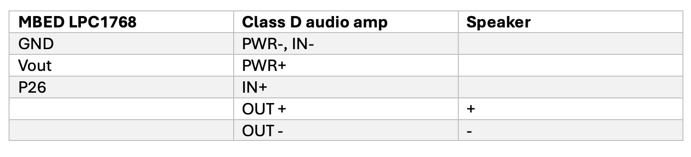
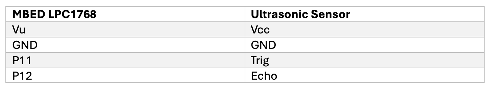
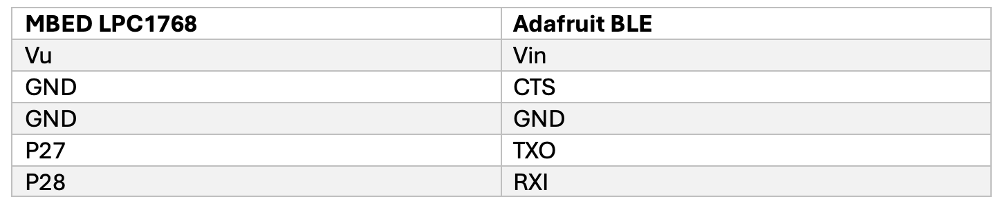
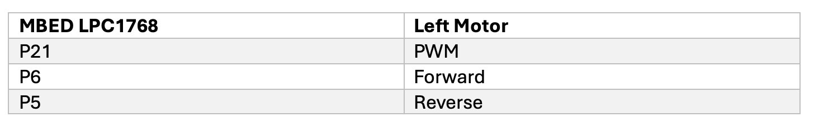
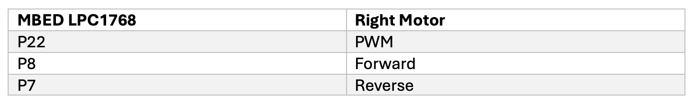

# ECE4180Project

# Color Following Robot
ECE 4180 Final Project Spring 2024  
Project Members: Matthew Chen, Shibao Su, Essie(Xinyi) Cao, Yash Fichadia

# Summary
Our goal is to put together a robot with autonomous color following capabilities, where a user can select a specific color, and the robot will autonomously move towards detections of that specific color, stopping when it reaches a certain distance threshold from that object. It will use a Raspberry Pi 4 with a PiCamera running an OpenCV powered project in real time, communicating with an mbed with an h-bridge to drive DC motors. There will also be an ultrasonic sensor indicating distances from nearby objects, using various speaker frequencies, for the safety of the robot. This robot will also have the option to be manually remote controlled, using a Bluetooth module and a pushbutton to change modes between manual Bluetooth control and autonomous color following.

# Parts List
- Raspberry Pi 4 (https://www.raspberrypi.com/products/raspberry-pi-4-model-b/)
- mbed LPC1768 (https://os.mbed.com/platforms/mbed-LPC1768/)
- Pi Camera (https://www.raspberrypi.com/documentation/computers/camera_software.html)
- Ultrasonic sensor (https://os.mbed.com/users/4180_1/notebook/using-the-hc-sr04-sonar-sensor/)
- Speaker (https://os.mbed.com/users/4180_1/notebook/using-a-speaker-for-audio-output/)
- H Bridge Motor Driver (https://os.mbed.com/users/4180_1/notebook/relays1/)
- Class D Amplifier (https://os.mbed.com/users/4180_1/notebook/tpa2005d1-class-d-audio-amp/)
- Bluetooth Module (https://os.mbed.com/users/4180_1/notebook/adafruit-bluefruit-le-uart-friend---bluetooth-low-/)
- DC motors (x2)
- Breadboard Power Supply Module
- Breadboard Barrel Jack Adapter

# Setup
-Block Diagram:

-Wiring: 
Speaker

Sonar Sensor

Bluetooth

Left Motor

Right Motor

Raspberry Pi and mbed are connected via USB serial

# Instructions

The backbone of this project is utilizing USB serial to communicate between the Raspberry Pi and the mbed, sending movement commands in the same format as the Bluetooth commands (using various characters to indicate a certain movement direction) to autonomously control the car. There are two scripts that need to be run for this project to work, the first being object_detection.py, which is runs on the Raspberry Pi. This script filters out parts of the input image that to not conform to the desired range of colors in the HSV color space and determines the center point of the detected object. Then, by observing the position of the point relative to the center of the robot and the size of the object itself, a movement command can be issued to the mbed telling the robot to move forward or backward if the object is to big/small, or left or right if the object is not centered horizontally. The second script, ECEFinalProject.cpp, is run on the mbed in conjunction with the first script, and reads in instructions using multithreading from the serial port (or Bluetooth for manual control), and drives the robot forwards, backwards, left, right, or stops the robot based on the instructions provided. It also reads the values from an ultrasonic sensor to determine the distance from various objects or obstacles in front of the robot and plays a tone on the speaker that increases in frequency as the robot gets closer.

In order for the robot to run autonomously, multiple pieces of hardware must work together, including the Raspberry Pi, the Pi Camera, the Ultrasonic sensor, the speaker, the H Bridge motor driver, DC motors, the Class D amplifier, and some barrel jacks/external power supplies. The Raspberry Pi recieves image data from the Pi Camera, and the mbed reads the instructions received from either the Raspberry Pi or Bluetooth, and uses the H Bridge to drive the DC motors individually at various speeds to achieve movement in different directions. The motors are powered using a 9V battery as a power supply. The ultrasonic sensor and the speaker must work in conjunction with each other through threading to provide the desired audio output based on distance.

The manual mode uses much of the same hardware, though the control scheme of the robot differs slightly. In this mode the car relies on commands received from a mobile phone via the connected Bluefruit Adafruit app. The app is configured to work as a controller, and consists of 4 arrow key buttons and a 4 button keypad. These buttons are mapped to different commands, which are sent to the mbed, and parsed into a switch case statement which will determine which direction the robot should move in. Just like autonomous mode, the motor speeds are set independently for each direction to ensure that controlling the robot is manageable from a user standpoint. A toggle button on the keypad on the app is also used for switching between manual and autonomous mode, disabling the ability for either USB serial or Bluetooth instructions to control the motors.

# Media
- Presentation Slides:  
https://docs.google.com/presentation/d/12a98qyBk1TE1SFsfPouObr0URmi0DXX__ShfMNphmeI/edit?usp=sharing

- Video of the two modes:   
https://youtu.be/m48Wb4iO9ZM  
https://youtu.be/f1ZGfoOcz-w

# Conclusion
The autonomous color following robot is currently in a very early development stages, with the fundamental ability to follow a user selected color. While still preliminary, this robot holds immense potential for enhancement and adaptation across various sectors, including warehousing, healthcare, home automation and education. In addition to enhancing operational efficiencies, this robot will also introduce new possibilities for automation in industrial environments or everyday life at home by continuing to refine its capabilities such as grabbing items and lifting heavy weights.
