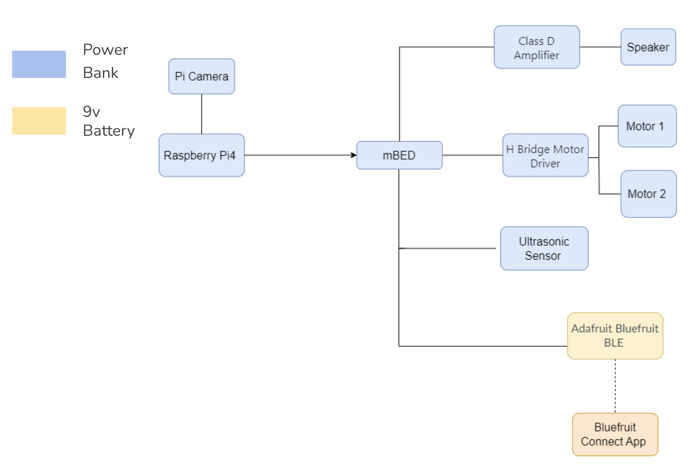

# ECE4180Project

# Color Following Robot
ECE 4180 Final Project Spring 2024  
Project Members: Matthew Chen, Shibao Su, Essie(Xinyi) Cao, Yash Fichadia

# Summary
Our goal is to put together a robot with autonomous color following capabilities, where a user can select a specific color, and the robot will autonomously move towards detections of that specific color, stopping when it reaches a certain distance threshold from that object. It will use a Raspberry Pi 4 with a PiCamera running an OpenCV powered project in real time, communicating with an mbed with an h-bridge to drive DC motors. There will also be an ultrasonic sensor indicating distances from nearby objects, using various speaker frequencies, for the safety of the robot. This robot will also have the option to be manually remote controlled, using a bluetooth module and a pushbutton to change modes between manual bluetooth control and autonomous color following.

# Parts List
- Raspberry Pi 4 (https://www.raspberrypi.com/products/raspberry-pi-4-model-b/)
- mbed LPC1768 (https://os.mbed.com/platforms/mbed-LPC1768/)
- Pi Camera (https://www.raspberrypi.com/documentation/computers/camera_software.html)
- Ultrasonic sensor (https://os.mbed.com/users/4180_1/notebook/using-the-hc-sr04-sonar-sensor/)
- Speaker (https://os.mbed.com/users/4180_1/notebook/using-a-speaker-for-audio-output/)
- H Bridge Motor Driver (https://os.mbed.com/users/4180_1/notebook/relays1/)
- Class D Amplifier (https://os.mbed.com/users/4180_1/notebook/tpa2005d1-class-d-audio-amp/)
- Bluetooth Module (https://os.mbed.com/users/4180_1/notebook/adafruit-bluefruit-le-uart-friend---bluetooth-low-/)
- Breadboard Power Supply Module
- Breadboard Barrel Jack Adapter

# Setup
Here is the block diagram:

Include wiring details
Include power/ battery details

# Instructions
...

# Media
- Presentation Slides (https://docs.google.com/presentation/d/12a98qyBk1TE1SFsfPouObr0URmi0DXX__ShfMNphmeI/edit?usp=sharing)

- Video of Automatic Object Detection Mode: 
[Watch the Video](videos /automatic_detection_mode.mp4)
[Watch the Video](videos /manual_mode.mp4)

# Conclusion
The autonomous color following robot is currently in a very early development stages, with the fundamental ability to follow a user selected color. While still preliminary, this robot holds immense potential for enhancement and adaptation across various sectors, including warehousing, healthcare, home automation and education. In addition to enhancing operational efficiencies, this robot will also introduce new possibilities for automation in industrial environments or everyday life at home by continuing to refine its capabilities such as grabbing items and lifting heavy weights.
